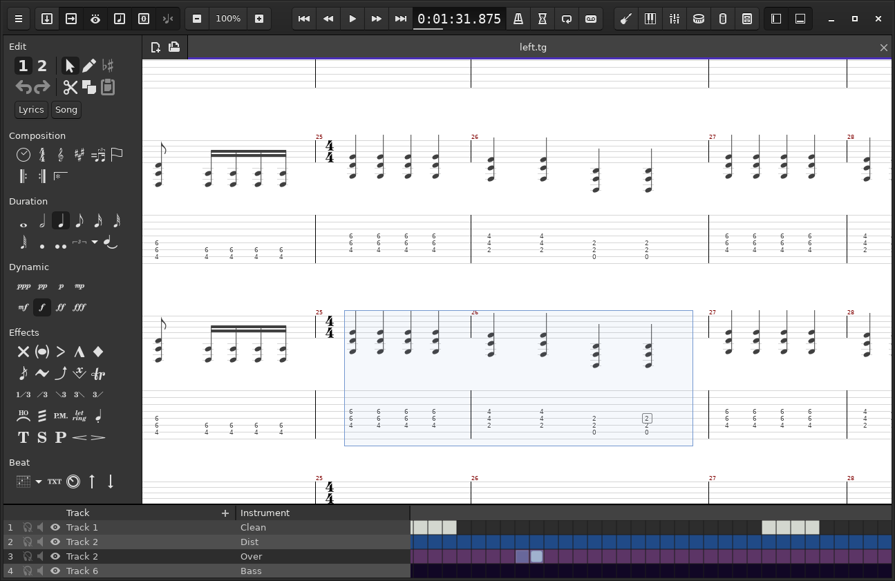

# TuxGuitar 2.0
This fork revives some features built by the community. You are great!!! Go ahead, check the instructions in [INSTALL.md](INSTALL.md) and contribute :-)

## What's new in v2.0:
- Global style update with a new skin
- Main toolbar redesigned
- Native window header and toolbar for the SWT GTK backend
- High DPI display support
- Hiding/showing of individual tracks
- Click-and-drag selection support, started by [Bartek Poleszak](https://github.com/bart-poleszak/TuxGuitar-workspace)
- Cut/Copy/Paste of individual notes
- More tuning presets, grouped by instrument and number of strings
- Default program/clef support for tunings
- Scale finder
- Customizable scale intervals
- Percussion dialog and percussion notation editor
- Support for mix table change commands from GP3/GP4/GP5 files
- UI cleanup, MIDI track name support by [Alex Abdugafarov](https://github.com/frozenspider/tuxguitar)
- Various bug fixes in importers/exporters by [b4dc0d3r](https://sourceforge.net/p/tuxguitar-fork)
- And lots of other small improvements and bug fixes

VST2 instrument support has been disabled, due to the SDK being discontinued.

## Recent changes in this fork:
26/07/2021
added yin algorithm to tuner

22/07/2021
added default shortcut for tuner: "shift t"

19/07/2021
added save / save as option to tab folder menu

16/07/2021
lilypond export is reverted to 1.5.4 - in
TuxGuitar-lilypond/src/org/herac/tuxguitar/io/lilypond/LilypondOutputStream.java
due to false enharmonics when exporting from gp3

14/07/2021
display fret numbers in chord diagrams only if higher than 1

13/07/2021
transpose tool has new option "transpose selection".

12/07/2021
added bach bourree as template / startup file, location:
/home/ptero/tuxguitar/TuxGuitar/share/templates/template-default.tg

key names instead of number of sharps / flats for german language file in
/home/ptero/tuxguitar/TuxGuitar/share/lang/messages_de.properties

changed keys for note duration change near the cursor arrows.
increase : ','  decrease: '-'
/home/ptero/tuxguitar/TuxGuitar/dist/tuxguitar-shortcuts.xml
i guess increase makes the notes smaller. 

01/07/2021
/TuxGuitar/share/lang/messages_de.properties
/TuxGuitar/share/lang/messages_en.properties
    -> added :
tools.transpose.apply-to-selection

A multitrack tablature editor and player for stringed instruments. This is a downstream fork
of [TuxGuitar](http://tuxguitar.com.ar/) with several changes merged in from the community.

TuxGuitar was originally developed by Julian Casadesus and many others. See [AUTHORS](AUTHORS)
for more information.

## System Requirements
- Java 9 or higher

## Build Instructions
See [INSTALL.md](INSTALL.md)
